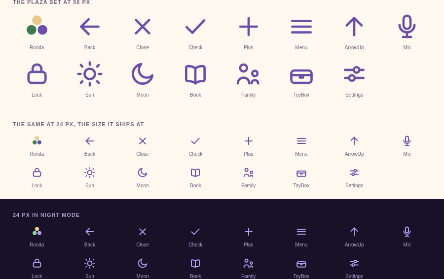

# Juguemos — Brand Brief

**Version:** 0.2 · September 2026 · Owner: Alex Otero · Issue: JUG-17

0.1 gave Juguemos a name, a wordmark, a palette, and a type scale. This is what 0.2 adds — iconography, the app icon, and a direction for illustration — written for you to judge rather than for an agent to build from. The rules an agent follows are in [design.md](design.md); where the two disagree, design.md is the one in force.

**Three things need your decision.** They are listed at the end. Everything else here is built and in the branch.

---

## 1. What the brand has to be

Juguemos is a play coach for families in Buenos Aires with children aged 1 to 5. A parent holds the phone, tired, one-handed, at 6pm on a rainy Tuesday. The child never looks at it.

So the brand has one difficult job: **be warm and playful without looking like a kids' app.** Kid styling — a mascot, glossy buttons, primary-colour blocks — tells a child the phone is for them, which is the opposite of what the app is for. The playfulness lives in the words and the colour. Everything drawn stays calm.

The second job is to be **from here**. Plaza, jacarandá, *rayuela*, *la ronda*, cardboard boxes. Not tango, mate, the Obelisco, or the flag.

## 2. What was already decided, and still holds

- **The name and wordmark.** "Juguemos" in Fredoka 600, with three dots in grass, sun, and jacarandá. The dots are a *ronda*. Trademark and domain checks are still pending from 0.1 — that is the oldest open item on the brand.
- **Two fonts.** Fredoka for display and buttons, Nunito Sans for body and story text. Fredoka 600 is the one childish-reading lever and it is at its limit.
- **One palette,** light and dark, in `tokens.css`. Sand background, jacarandá primary, grass for meta labels.
- **Flat.** No gradients, gloss, 3D, or drop shadows.

## 3. The app icon

**The mark is the ronda, not the wordmark.** "Juguemos" is nine letters and it is unreadable at 48 px, let alone at 16. The three dots are the part of the identity that survives being shrunk, and they carry all three brand colours.

**The field is jacarandá,** with the dots in sun, grass, and sand. Two reasons: a light sand tile disappears among saturated app icons on a home screen, and a purple field reads on a light and a dark home screen without needing two versions. The trade is that the icon no longer contains a jacarandá *dot* — the field became the jacarandá.

**It is one drawing.** Full bleed, because Android crops a maskable icon to whatever shape the phone uses, and the ronda sits inside the safe zone, so the same file serves the circle, the squircle, the square, and the favicon. The strip above is what a phone actually shows at each size. The 16 px end is the tightest: three dots, still distinguishable.

The icon does not follow night mode. A home-screen icon can't.

**Not proposed:** a letterform J, which loses the ronda; the wordmark on a tile, which is illegible; and anything with a face.

## 4. Iconography

Fifteen icons, replacing the `←`, `✕`, `✓`, `×`, `+` and `↑` characters the app was borrowing from the phone's font, and the hamburger and padlock it was drawing in CSS.

**They are one drawing rule, not fifteen decisions.** 24 px grid, a 2 px stroke, round caps, no fill, no second colour, no background plate. That 2 px matches the borders the app already uses on the mic and on a toggle's mark, which is why the set sits in the existing screens rather than on top of them. Colour comes from whatever the icon sits in, so night mode needs no second set — the bottom row is the same fourteen files.

**The ronda is the exception,** and the only filled icon: it is the brand mark, in the wordmark's three colours, and it marks ¡Juguemos! in the menu.

**What icons don't do here.** No button loses its words to an icon. Icons sit on the small controls — back, close, the menu, the mic, a chip's mark, a drawer row — and every one is decorative, with the label on the button around it. A chosen chip gets a check *and* a fill, never colour alone.

**Sliders for Ajustes rather than a gear.** A gear reads mechanical, and this app is not a machine.

**One thing to look at:** the menu's rows now carry an icon each. That is the only change in this branch beyond swapping one mark for a better-drawn one, and it is the easiest thing to undo if you'd rather the menu stayed words only.

## 5. Illustration

**Nothing in 0.2 needs illustration,** so this is a direction to pick, not a thing to commission now. Three routes, all of which obey the same fences: never on the reading screen or the story options, never a character or a mascot, token colours only, and drawn by a named illustrator — never generated, never imitated.

### A. Paper and scissors

Cut-paper shapes in flat token colour, no outline: a plaza built from a jacarandá's three purple masses, a bench, a cardboard box. The subject is local; the technique is the app's own flatness.

*Reference:* Istvansch (Istvan Schritter), whose paper cut-outs are the clearest Argentine example, and the cardboard the app already talks about.

**For:** it cannot break rule 4, because it is already flat. It works in both colour sets with no second version. A small set is cheap to commission and easy to extend later.
**Against:** the coolest of the three. Done badly it reads like a corporate vector illustration.

### B. Chalk on the pavement

Marks the way a *rayuela* is chalked onto a plaza's tiles: a hopscotch grid, a ronda, a scribbled sun. One or two token colours, on the sand background, with the grain of real chalk.

*Reference:* the plaza floor itself; Isol's scratchy, deliberately imperfect line.

**For:** the most unmistakably from Buenos Aires, and the lightest touch — it can be a motif on an empty state rather than a picture. Cheapest to apply.
**Against:** texture is the one thing rule 12 says has to be real, so this direction depends completely on finding the right hand. It also risks being decoration rather than meaning.

### C. The plaza at the hour

Warm painted scenes — gouache, visible brush — of a plaza whose light changes with the time of day. The same square in the afternoon and at dusk, which is the app's night mode made literal.

*Reference:* Mariana Ruiz Johnson; the Limonero catalogue; Decur.

**For:** by far the warmest, and the best answer for the entrada screen, where a parent is arriving and has a moment.
**Against:** the most expensive, the slowest, the hardest to keep on the grown-up side of the line, and the only one that needs a second version for night mode.

### The recommendation

**A, with the plaza as its subject.** It is the only one that can't fight the design rules already in force, it costs one commission rather than a relationship, and it needs no second drawing for night mode. B is the better idea and the worse bet: it lives or dies on the illustrator, and we don't have one yet.

Either way, **commission nothing until a screen wants it.** The places worth drawing for are the entrada screen and an empty baúl, moments where a parent is arriving. Never between a parent and a juego. The two waiting animations (JUG-132, JUG-133) shipped as CSS shapes from the plaza and stay that way.

### Illustrators

These are style references, not a shortlist: nobody has been approached, and nothing is known here about rates or availability. They are Argentine children's-book illustrators whose work sits near one of the directions above, and they are where to start looking.

| Direction | Worth looking at |
|---|---|
| A — Paper and scissors | Istvansch, Cristian Turdera |
| B — Chalk | Isol |
| C — The plaza | Mariana Ruiz Johnson, Decur (Gonzalo Kenny) |

Pablo Bernasconi is the best-known Argentine illustrator working in collage, and is worth seeing, but the work is surreal and reads adult — probably wrong for this.

## 6. What needs your decision

1. **The illustration direction** (JUG-85): A, B, C, or "not yet". Nothing is blocked either way. The answer goes into design.md.
2. **The menu's icons.** Keep the icon on each drawer row, or leave the menu as words. The only judgment call in the branch.
3. **The app icon's field:** jacarandá as built, or sand with the three wordmark dots, which matches the wordmark exactly but goes quiet on a home screen.

And one older item, still open from 0.1: **the wordmark's trademark and domain checks.**

---

*The two images in this brief are snapshots, rendered from `web/src/shared/ui/Icons.jsx` and `web/public/icon.svg` when it was written. The files are the source; these go stale.*
